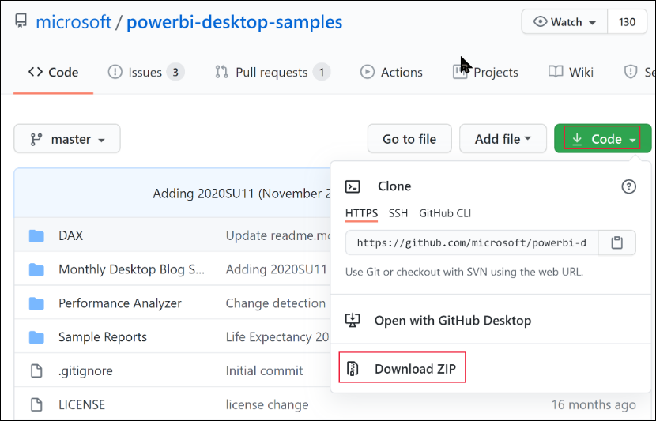

# Lab 7 - Embedded Power BI App in Web App

**Contents** 

<!-- TOC -->

- [Introduction](#introduction)
- [Embedded Power BI](#embedded-power-bi)
- [References](#references)

## Introduction

**Embedded analytics** and **Power BI Embedded** (the Azure offer) allow you to embed Power BI content such as reports, dashboards and tiles, into your application.

In this lab, you'll learn how to:

 - Set up your embedded environment.
 - Configure an embed for your customers (also known as app owns data) sample application.

To use application, users won't need to sign in to Power BI or have a Power BI license.

We recommend using the embed for users method to embed your Power BI content, if you're an independent software vendor (ISV) or a developer, who wants to create applications for third parties.

### Code sample specifications

This lab includes instructions for configuring an embed for sample application in one of the following frameworks:

 - .NET Framework
 - .NET Core
 - Java
 - Node JS
 - Python

The code samples support the following browsers:

 - Microsoft Edge
 - Google Chrome
 - Mozilla Firefox

## To create an embed for users sample app, follow these steps:

### Task 1 - Select your authentication method

Your embedded solution will vary depending on the authentication method you select. Therefore, it's important to understand the differences between the authentication methods, and decide which one best suits your solution.

The table below describes a few key differences between the [service principal](https://docs.microsoft.com/en-us/power-bi/developer/embedded/embed-service-principal) and **master user** authentication methods.

   | Consideration            | Service principal             | Master user             |
   | ------------------------ | ----------------------------- | ----------------------- |
   | Mechanism                | Your Azure AD app's [service principal object](https://docs.microsoft.com/en-us/azure/active-directory/develop/app-objects-and-service-principals#service-principal-object) allows Azure AD to authenticate your embedded solution app against Power BI.                              | Your Azure AD app uses the credentials (username and password) of a Power BI user, to authenticate against Power BI. |
   | Security                         | Service principal is the Azure AD recommended authorization method. If you're using a service principal, you can authenticate using either an application secret or a certificate. This lab only describes using service principal with an application secret. To embed using a service principal and a certificate, refer to the [service principal with a certificate](https://docs.microsoft.com/en-us/power-bi/developer/embedded/embed-service-principal-certificate) article.                              | This authentication method isn't as secure as a service principal. You have to be vigilant with the master user credentials (username and password). For example, don't expose them in your embedding application, and change the password frequently. |
   | Azure AD delegated permissions   | Not required.   | Your master user or an administrator has to grant consent for your app to access Power BI REST API [permissions](https://docs.microsoft.com/en-us/azure/active-directory/develop/v2-permissions-and-consent) (also known as scopes). For example, Report.ReadWrite.All. |
   | Power BI service access      | You can't access Power BI service with a service principal.    | You can access Power BI service with your master user credentials. |
   | License    | Doesn't require a Pro license. You can use content from any workspace that you're a member or an admin of. | Requires a [Power BI Pro](https://docs.microsoft.com/en-us/power-bi/enterprise/service-admin-purchasing-power-bi-pro) or Premium Per User (PPU) license. |

### Task 2 - Register an Azure AD application

Registering your application with Azure AD allows you to:

 - Establish an identity for your app
 - Let your app access the [Power BI REST APIs](https://docs.microsoft.com/en-us/rest/api/power-bi/)
 - If you're using a master user - Specify your app's [Power BI REST permissions](https://docs.microsoft.com/en-us/azure/active-directory/develop/v2-permissions-and-consent)

To register your application with Azure AD, follow the instructions in [Register your application](https://docs.microsoft.com/en-us/power-bi/developer/embedded/register-app).

> **Note**: Before registering your application, you'll need to decide which authentication method to use, service principal or master user.

### Task 3 - Create a Power BI workspace

Power BI keeps your reports, dashboards, and tiles in a workspace. To embed these items, you'll need to create them and upload them into a workspace.

 >**Tip**: If you already have a workspace, you can skip this step.

1. To create a workspace, do the following:

2. Sign in to Power BI.

3. Select Workspaces.

4. Select Create a workspace.

5. Name your workspace and select Save.

### Task 4 - Create and publish a Power BI report

Your next step is to create a report and upload it to your workspace. You can [create your own report](https://docs.microsoft.com/en-us/power-bi/fundamentals/desktop-getting-started#build-reports) using Power BI Desktop, and then [publish](https://docs.microsoft.com/en-us/power-bi/fundamentals/desktop-getting-started#share-your-work) it to your workspace. Or, you can upload a sample report to your workspace.

 >**Tip**: If you already have a workspace with a report, you can skip this step.

To download a sample report and publish it to your workspace, follow these steps:

1. Open the GitHub [Power BI Desktop samples](https://github.com/microsoft/PowerBI-Desktop-Samples) folder.

2. Select **Code** and then select **Download zip**.

   

3. Extract the downloaded ZIP and navigate to the Samples Reports folder.

4. Select a report to embed, and [publish](https://docs.microsoft.com/en-us/power-bi/fundamentals/desktop-getting-started#share-your-work) it to your workspace.

### Task 5 - Get the embedding parameter values

To embed your content, you need to obtain certain parameter values. The table below shows the required values, and indicates if they're applicable to the service principal authentication method, the master user authentication method, or both.

Before you embed your content, make sure you have all the values listed below. Some of the values will differ, depending on the authentication method you're using.

### Client ID

>**Tip**: Applies to: Service principal Master user

To get the client ID GUID (also know as application ID), follow these steps:

1. Log into [Microsoft Azure](https://ms.portal.azure.com/#allservices).

2. Search for **App registrations** and select the **App registrations** link.

3. Select the Azure AD app you're using for embedding your Power BI content.

4. From the **Overview** section, copy the **Application (client) ID** GUID.

### Workspace ID

>**Tip**: Applies to: Service principal Master user

To get the workspace ID GUID, follow these steps:

1. Sign in to Power BI service.

2. Open the report you want to embed.

3. Copy the GUID from the URL. The GUID is the number between **/groups/** and **/reports/**.

   

Alternatively, you can find the workspace ID in the **Admin portal** settings by selecting **Details** next to the workspace name.

### Report ID

>**Tip**: Applies to: Service principal Master user

To get the report ID GUID, follow these steps:

1. Sign in to Power BI service.

2. Open the report you want to embed.

3. Copy the GUID from the URL. The GUID is the number between **/reports/** and **/ReportSection**.

   

### Client secret

>**Tip**: Applies to: Service principal Master user

To get the client secret, follow these steps:

1. Log into [Microsoft Azure](https://ms.portal.azure.com/#allservices).

2. Search for **App registrations** and select the **App registrations** link.

3. Select the Azure AD app you're using for embedding your Power BI content.

4. Under **Manage**, select **Certificates & secrets**.

5. Under **Client secrets**, select **New client secret**.

6. In the **Add a client secret** pop-up window, provide a description for your application secret, select when the application secret expires, and select **Add**.

7. From the **Client secrets** section, copy the string in the **Value** column of the newly created application secret. The client secret value is your client ID.

> **Note**: Make sure you copy the client secret value when it first appears. After navigating away from this page, the client secret will be hidden and you'll not be able to retrieve its value.

### Tenant ID

>**Tip**: Applies to: Service principal Master user

To get the tenant ID GUID, follow these steps:

1. Log into [Microsoft Azure](https://ms.portal.azure.com/#allservices).

2. Search for **App registrations** and select the **App registrations** link.

3. Select the Azure AD app you're using for embedding your Power BI content.

4. From the **Overview** section, copy the **Directory (tenant) ID** GUID.

### Power BI username and password

>**Tip**: Applies to: Service principal Master user

Obtain the username and password of the Power BI user you're using as your **master user**. This is the same user you used to create a workspace and upload a report to, in Power BI service.

### Task 6 - Service principal API access

