# Hands-on Lab: Create and Publish PowerBI Dashboards & Reports

In this lab, you will create and publish Power BI dashboards and reports, applying conditional formatting, adding logos, importing custom visuals, and using bookmarks to enhance storytelling.

## Lab Objectives

- Task 1 : Power BI Service – Publishing Report
- Task 2 : Power BI – Building a Dashboard
  
### Pre-requisites

1. Navigate to [https://app.powerbi.com](https://app.powerbi.com/) in the LabVM browser using the credentials below

   - **Email/Username:** <inject key="AzureAdUserEmail"></inject>
   - **Password:** <inject key="AzureAdUserPassword"></inject>

   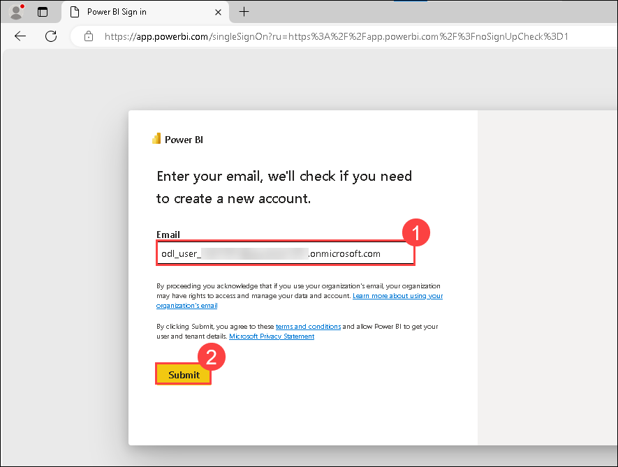

   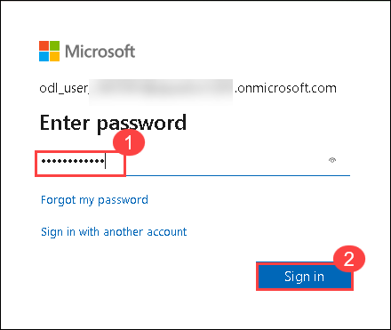

1. If **Action required** window pops-up, select **Ask later**

   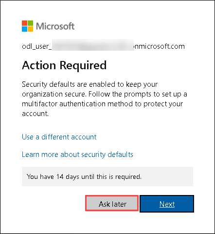

1. If **Stay signed in** window pops-up, select **No**

   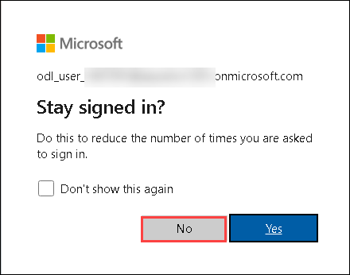
 
1. Once logged in, navigate to **Settings (1)** icon and select **Admin Portal (2)**

   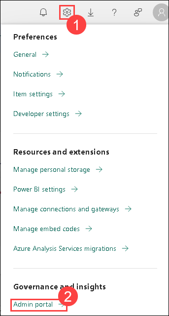 

1. On the **Tenant settings (1)**, search for **map (2)** then select **Map and filled map visuals (3)** then toggle the bar to **Enable (4)** and then click on **Apply (5)** to enable the settings.

   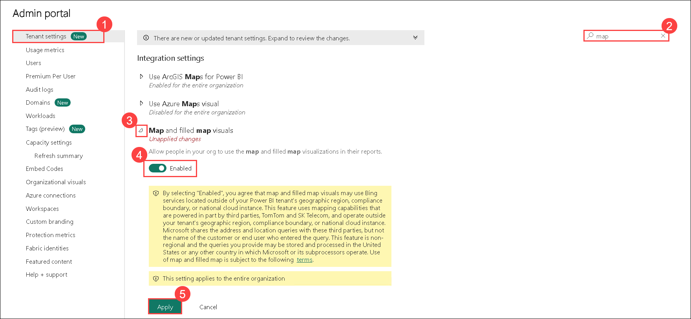 

   >**Note**: Please wait for 15 mins and continue with the next task.

### Task 1 - Power BI Service – Publishing Report

1. Navigate to **PowerBI desktop** and sign in using the same credentials used for app service.

   - **Email/Username:** <inject key="AzureAdUserEmail"></inject>
   - **Password:** <inject key="AzureAdUserPassword"></inject>

1. For **Stay signed in to all your apps** window, select **No, sign in to this app only**

   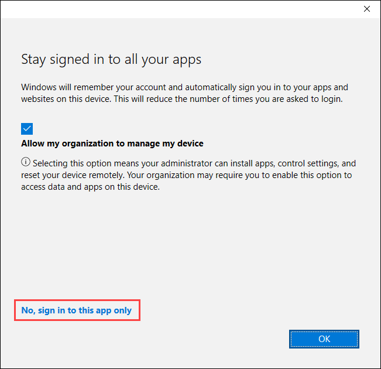 

1. Navigate to the **DIAD** folder and then to the Reports folder (C:\DIAD\DIADL4\Reports) folder in the LabVM

1. Open the DIAD Final Report.pbix file. 

   >**Note**: This file uses the same dataset that you used for the lab. We have added more visuals and performed additional formatting in the report. Feel free to explore the report.

   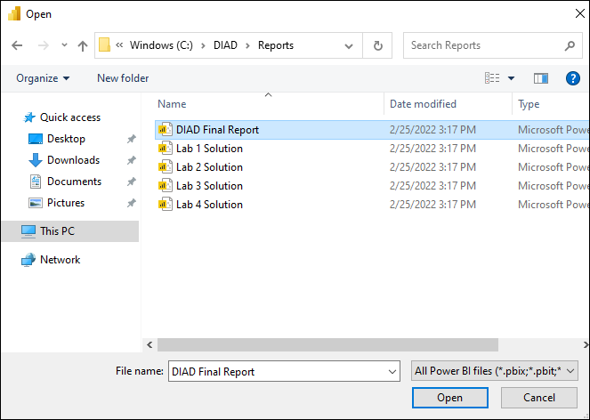 

1. On the **DIAD Final Report**, to enable the **Map and filled map visuals** like Power BI follow the below steps.

    - Click on **File** from the top left menu.

      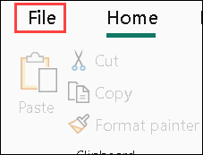    

    - Click on **Options and settings (1)** and then **Options (2)**  

       

    - Click on **Security (1)** then select the check box for **Map and Filled map visuals (2)** and then click on **OK (3)**

      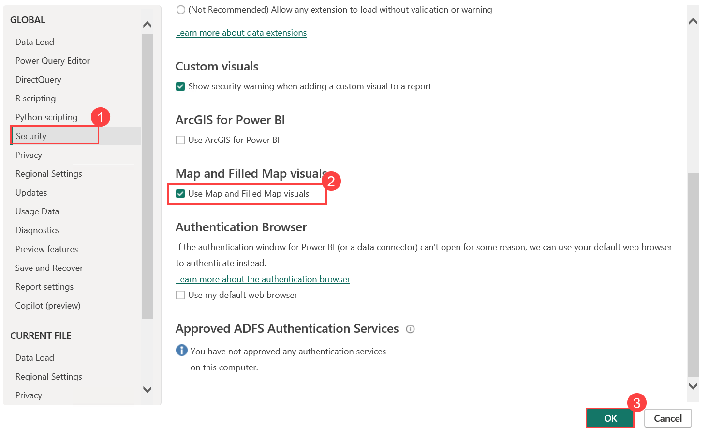 

1. Highlight the **Market Analysis (1)** title and change the text color to **black (2)**.

   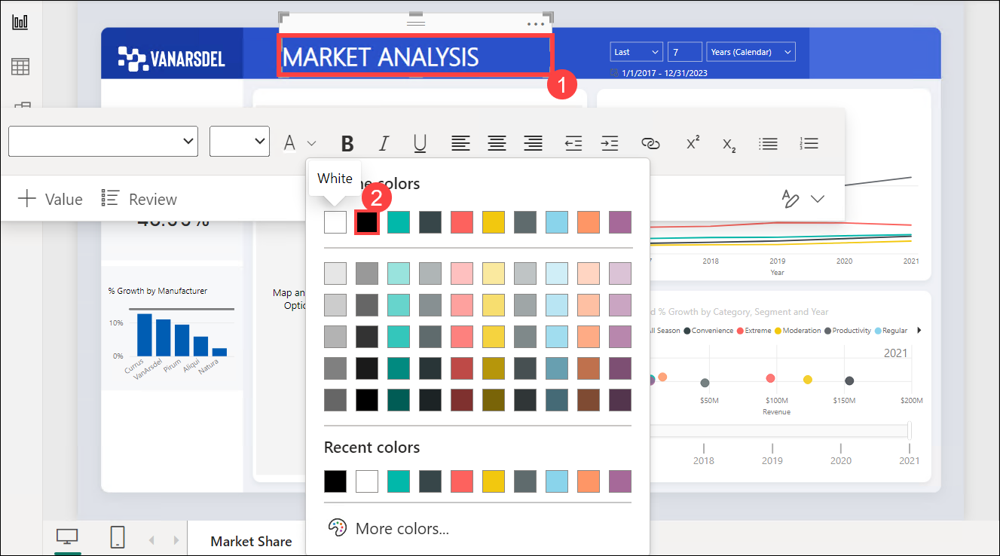 

1. Click the **View (1)** ribbon and then click **Mobile layout (2)**.

   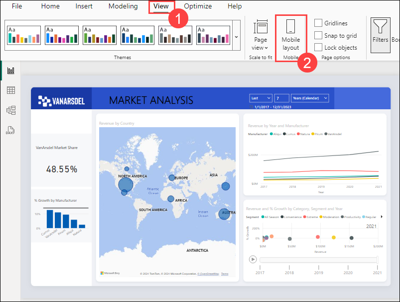 

1. Drag the **Market Analysis** title to the top of the phone layout.

   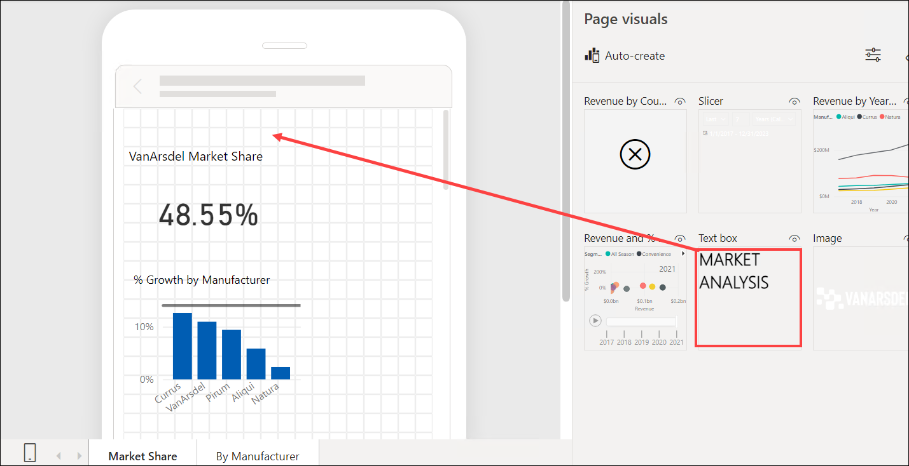

   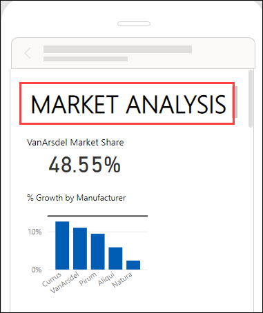   

   >**Note:** If you recieve any pop up, click on **Close**.

1. Click on the **View (1)** tab and **turn on (2)** the *Selection pane* by clicking on it. This allows you to change the layer order 
while creating a mobile layout.

   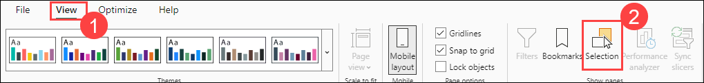

1. Click on the **View (1)** tab and turn off **Gridlines** and **Snap to Grid** **(2)** and **turn off (3)** the *Selection pane*.

   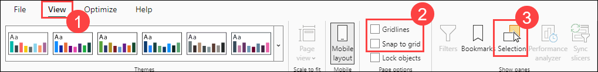

1. Drag the **Revenue by Year and Manufacturer** line chart below the card on the phone layout. Resize the line chart to stretch across the phone layout.

   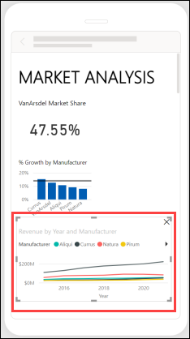

1. Drag the **map** below the line chart on the phone layout, resize the map, and then save the file.

   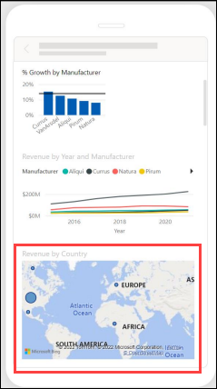

1. Click **Save** to save your workbook

   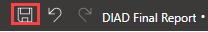

1. If you have not already opened the **app.powerbi.com** page, please open a browser and navigate to [https://app.powerbi.com](https://app.powerbi.com/)

1. Sign-in to Power BI using your user account. Once logged in, you will be taken to the **Home** screen.

1. In the left panel, click on **Workspaces**.
   
    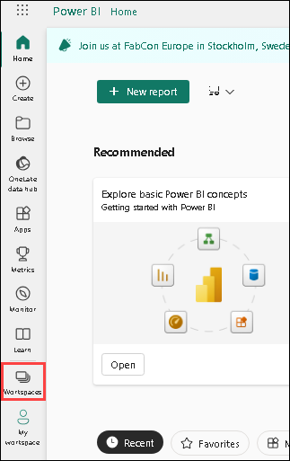

1. Click on **+ New workspace**. Then *Create a workspace* dialog box opens.

    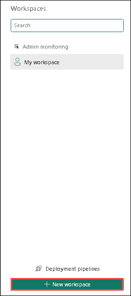

    >**Note**: Creating workspace is a **Pro feature**.

1. On the **Create a workspace** page, give the following details then click on **Apply (4)**.

    - In the **Name your workspace** text area, type **DIAD_<inject key="DeploymentID" enableCopy="false"/> (1)**.

    - In the **Description** text area, type **This is DIAD workspace (2)**.

    - Click **Upload (3)**.

      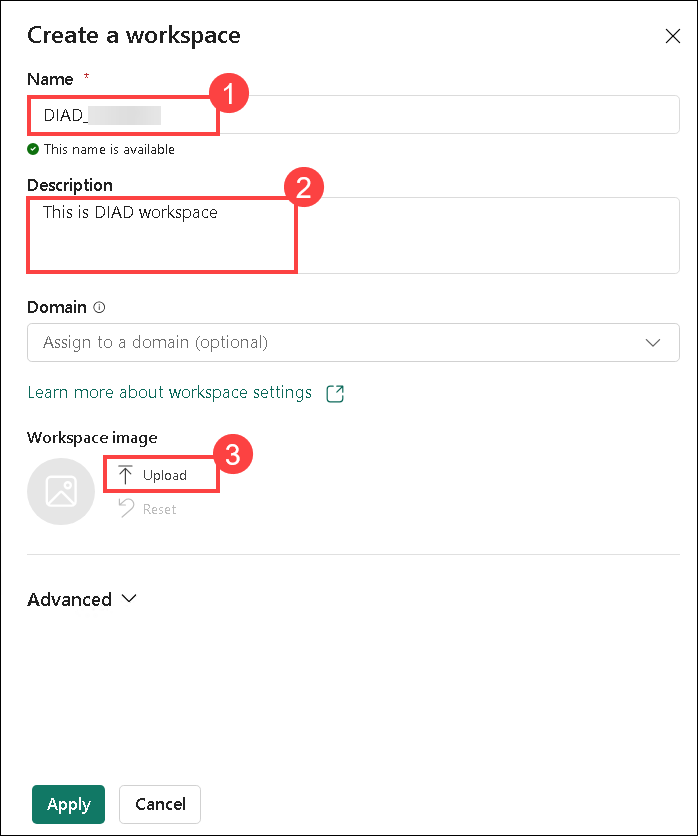

    - A file browser dialog box opens. Browse to the **DIAD** folder and then the **Data** folder (**C:\DIAD\DIADL4\Data**). Select **VanArsdel_WSLogo (1)** file and click **open (2)**

      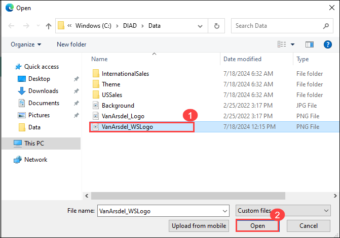

1. Click **Apply (4)** to create the workspace.

    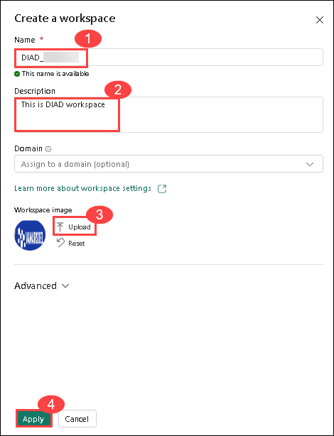

1. Let’s publish the report to Power BI Service and then we will come back to the browser.

1. Navigate back to the **DIAD Final Report** in PowerBi desktop.

1. Ensure **Mobile View** is **off.**

1. From the **Home (1)** tab, click **Publish (2).**

    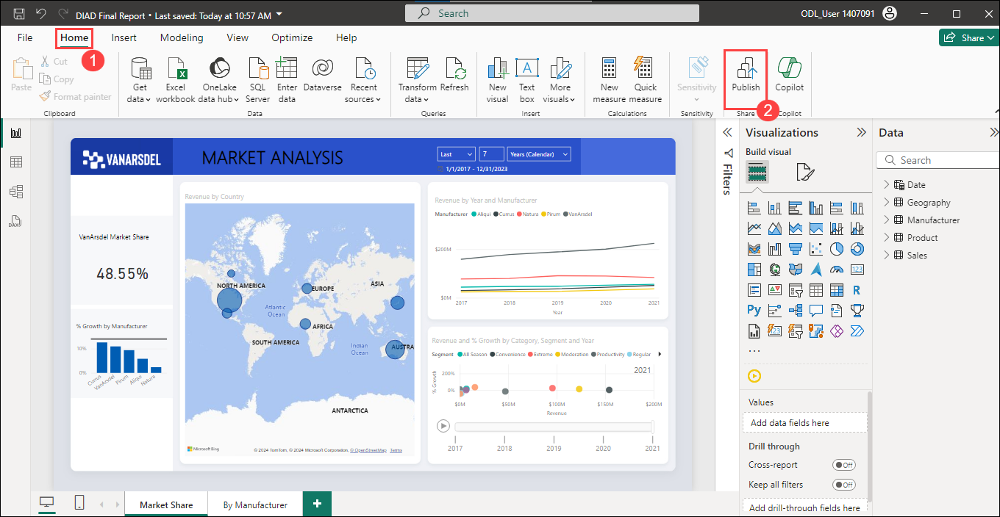

1. Click on **Save**

    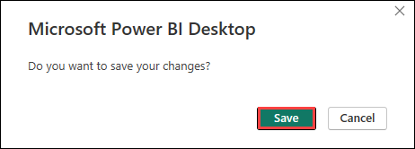

1. If you have not already logged into Power BI, a **Sign in** dialog box opens. Please sign in.  

   - **Email/Username:** <inject key="AzureAdUserEmail"></inject>
   - **Password:** <inject key="AzureAdUserPassword"></inject>

     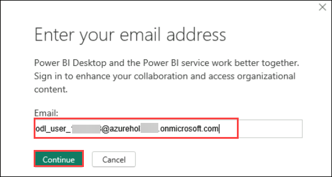 
    
1. For **Stay signed in to all your apps** window, select **No, sign in to this app only**

    

1. Once you are signed in, the **Publish to Power BI** dialog box opens. select **DIAD_<inject key="DeploymentID" enableCopy="false"/> (1)** in the dialog box and click **Select (2)**

    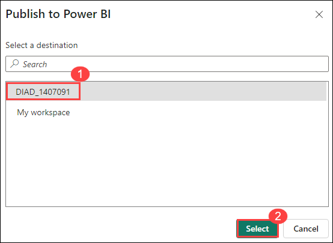

1. The **Publishing to Power BI** dialog box opens. Once the process is complete, a success message displays.

    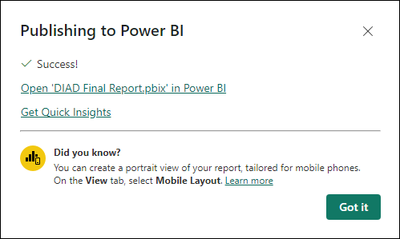 
  
1. Click **Got it** to close the dialog box.

    >**Note**: Now that we have published the report to the Power BI service, let’s navigate back to the browser and start exploring. 
    
1. Once you are in the browser, in the left panel notice that under **DIAD_<inject key="DeploymentID" enableCopy="false"/>**, you see **Reports** has the **DIAD Final Report**.

    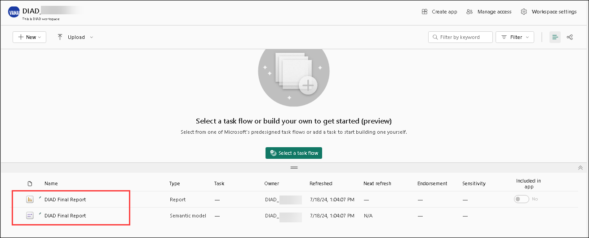 

### Task 2- Power BI – Building a Dashboard

In this section, we will create a dashboard that combines data from the **Market Share** report. 
  
By the end of this section, we will have created a dashboard that looks like the screenshot below.

  
  
1. Click the **DIAD Final Report.** You are navigated to the report you just uploaded.   

    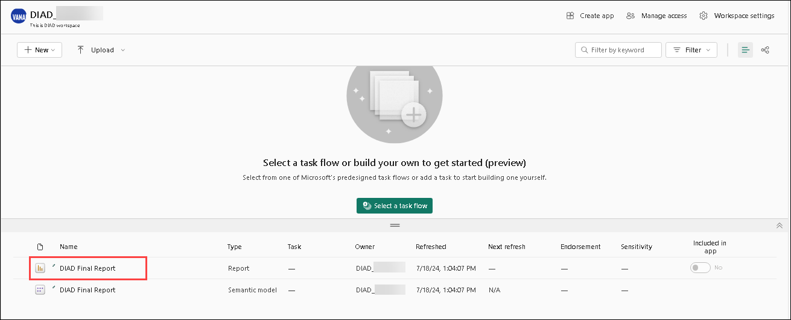
  
1. In the **map visual**, enable drill-down by *hovering* over the visual and click on the **down arrow (1)** on the top right corner of the visual and then Select **Australia (2)** to drill-down to the **State** level.

    

1. Now let’s pin visuals to the dashboard.

1. Hover over the **VanArsdel Market Share** card visual.

1. Click the **pin** icon on the top right of the visual. The **Pin to dashboard** dialog box opens.

    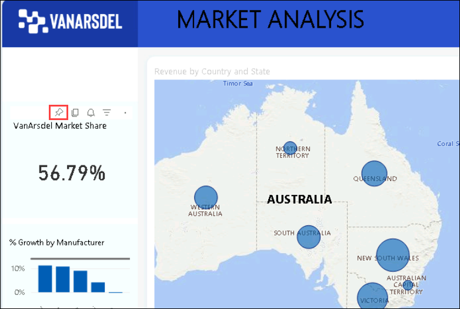

1. We do not have a dashboard yet. Let’s create one. With **New dashboard (1)** selected, enter **VanArsdel (2)** in the text box then click on **Pin (3)**.
  
    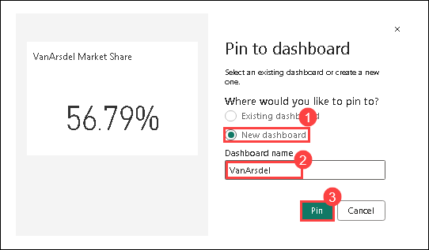
 
    >**Note**: Notice that alert messages are displayed stating the dashboard is ready to view.

1. Notice in the left panel, the **VanArsdel** dashboard is created under **DIAD_<inject key="DeploymentID" enableCopy="false"/>**.

    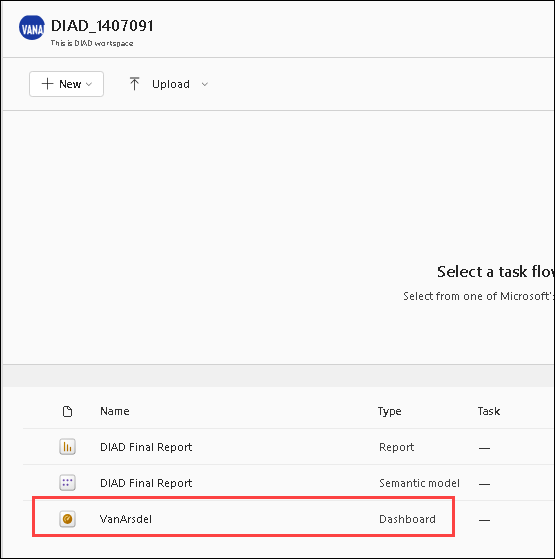
  
1. From the left panel, click on **VanArsdel (1)** and then click **VanArsdel Market Share (2)**.

    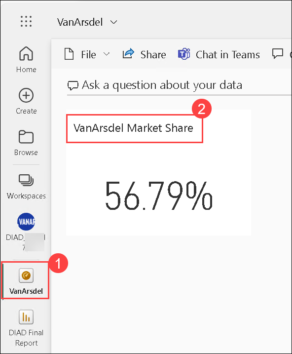

    Notice the **VanArsdel Market Share** tile is pinned to the dashboard.

1. Click **VanArsdel Market Share,** notice that you are navigated to the report.

    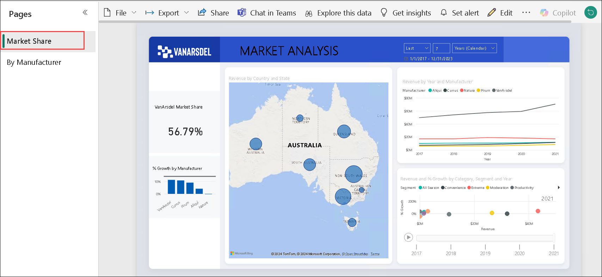

    >**Note:** Tiles in the dashboard are not interactive.

1. Hover over the **% Growth by Manufacturer** visual. Click the **pin** icon on the top right of the visual. The **Pin to dashboard** dialog box opens.

    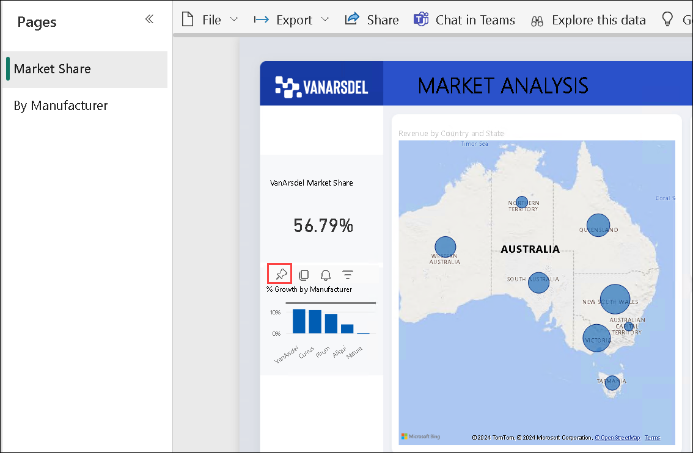

1. Make sure that **Existing dashboard (1)** then **VanArsdel (2)** is selected in the drop-down and then click on **Pin (3)**.

    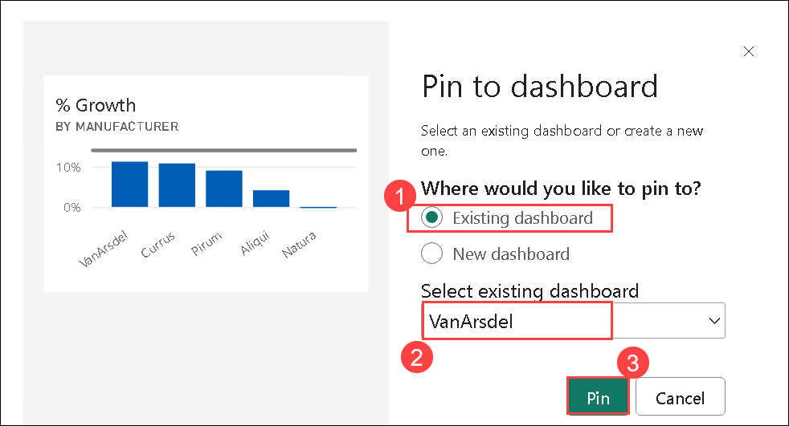
  
1. Closeout the alert dialog boxes.

1. Hover over the **Revenue by Year and Manufacturer** visual.
Click the **pin** icon on the top right of the visual. The **Pin to dashboard** dialog box opens.

    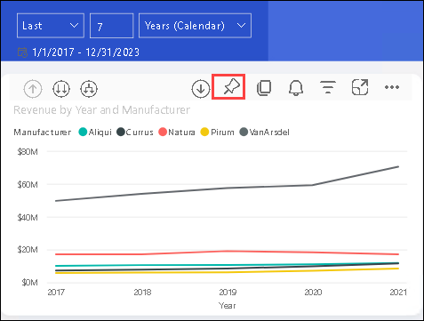

1. Make sure that **Existing dashboard (1)** then **VanArsdel (2)** is selected in the drop-down and then click on **Pin (3)**.

    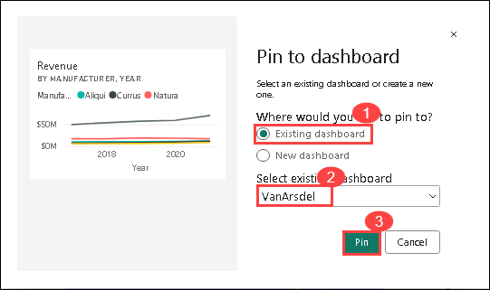
   
1. Closeout the alert dialog boxes.

1. Navigate to the **By Manufacturer** page.

    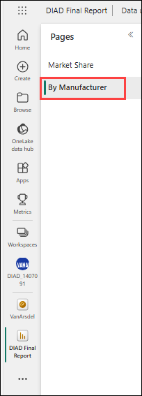

1. From the top right corner, click the **down arrow**. Notice that the **manufacturer** slicer displays.

   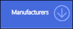

1. Click **VanArsdel** in the slicer. This will filter the visuals.

   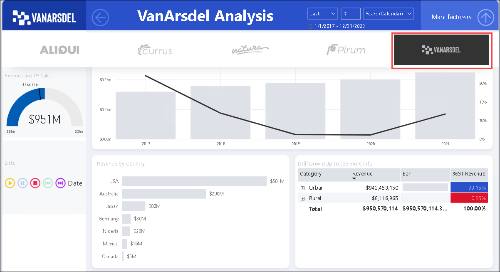

1. From the top right corner, click the **up arrow**. Notice that the **manufacturer** slicer collapses.
  
   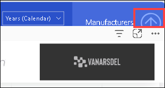

1. **Pin** the **Revenue, PY Sales(guage)** to the dashboard.

   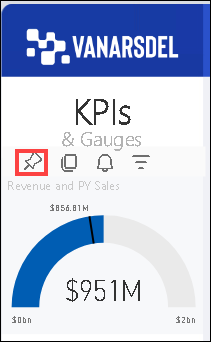

1. Make sure that **Existing dashboard (1)** then **VanArsdel (2)** is selected in the drop-down and then click on **Pin (3)**.

    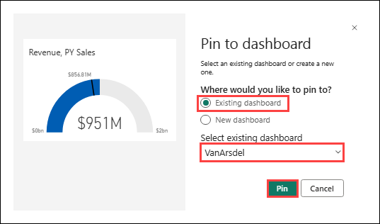

1. **Pin** the **Revenue by Country** visual to the dashboard.

   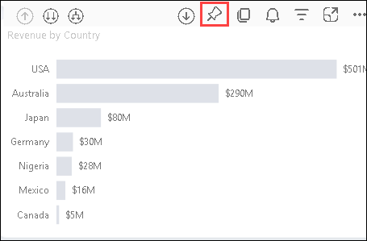

1. Make sure that **Existing dashboard (1)** then **VanArsdel (2)** is selected in the drop-down and then click on **Pin (3)**.

    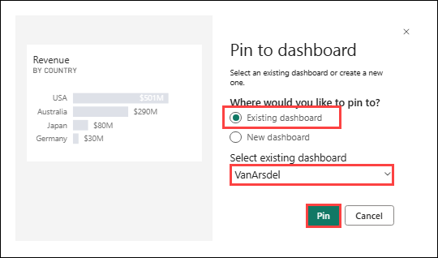   

1. Closeout the alert dialog boxes.
  
    >**Note:** The **VanArsdel** filter is applied to the tile that is pinned to the dashboard.

1. From the left panel, select the **DIAD_<inject key="DeploymentID" enableCopy="false"/> (1)**, click **VanArsdel (2)** Dashboard Notice that all the visuals are pinned as tiles to the dashboard.

   

   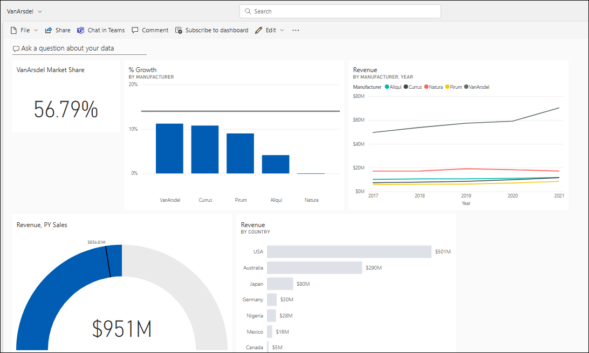    

    >**Note**: You will see the visuals on the dashboard like in the screenshot. Each visual on the dashboard is called a tile. The tiles represent the data chosen and are kept up to date as the data in the data model updates. Tiles are not interactive.

#### Let’s organize the dashboard.

1. Resize and move the **gauge** tile as shown in the screenshot.

1. Click the bottom right corner of the tile and move it diagonally to change the image size.

    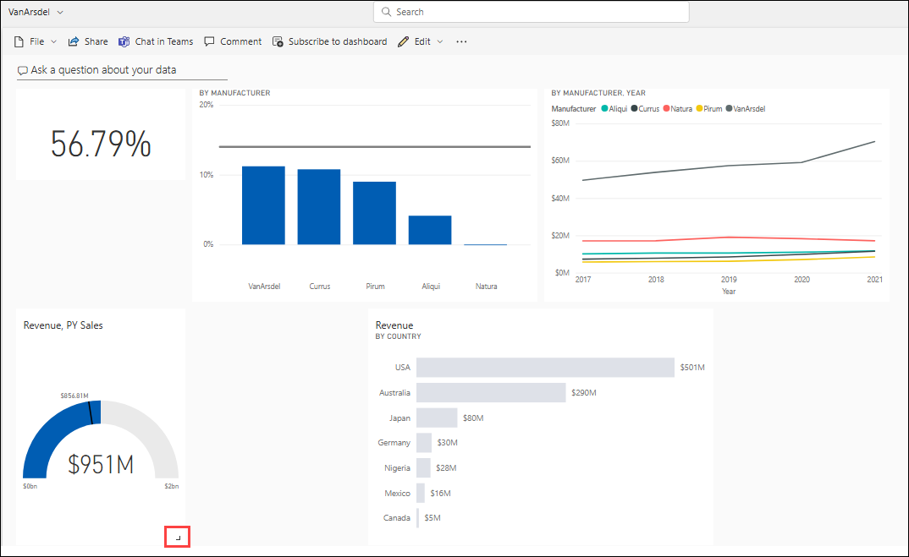
  
    Tiles can be of various sizes (1x1 to 5x5). Drag the tile using the bottom right corner to resize it. 

1. Click the **Edit (1)** dropdown and click **Add tile (2)**. 

    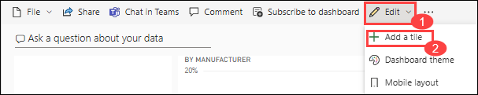

1. On the **Add tile** dialog box, click **Image (1)** as the source and select **Next (2)**.

    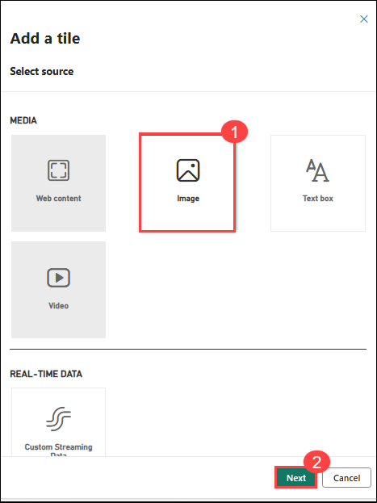

1. In the **URL** text box, type the following URL: <https://raw.githubusercontent.com/CharlesSterling/DiadManu/master/Vanarsdel.png> **(1)** and click **Apply (2)**.

    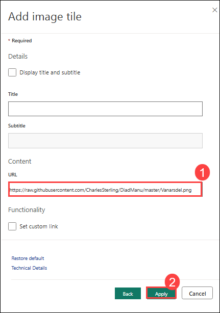 
  
   >**Note:** The URL is case sensitive.

1. Notice that a new tile with the **VanArsdel** logo is added to the dashboard.

    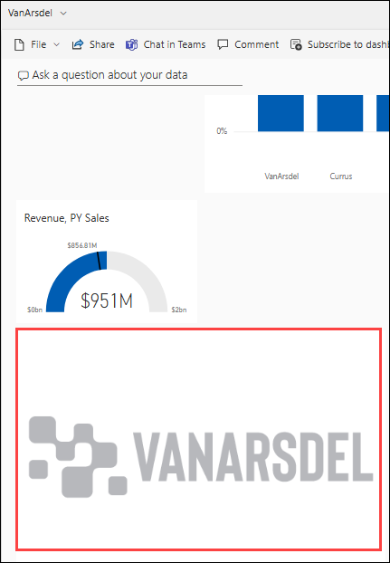
  
1. Resize and rearrange the tiles as shown in the screenshot.

    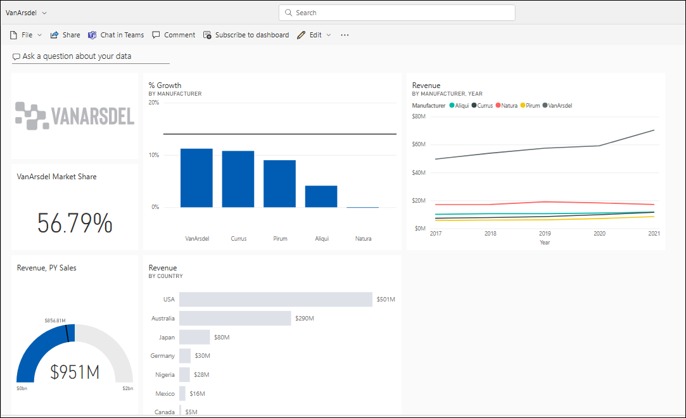

1. The **Revenue by Country** tile shows Revenue by Country for VanArsdel, let’s rename it.

1. Hover over **Revenue by Country** tile.

1. Click the ellipse **(...) (1)** in the top right corner of the tile and then click **Edit Details (2)**. The **Tile Details** dialog box opens.

    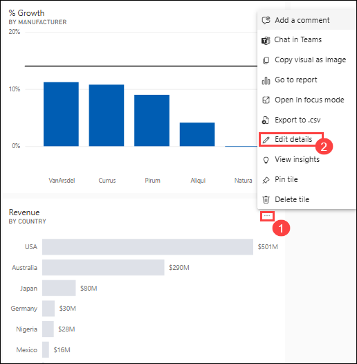

1. On the **Tile Details** page, Change the **Title** to **VanArsdel Revenue (1)** then click **Apply (2)**

    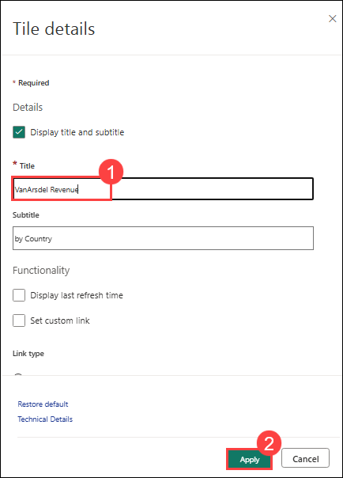

1. Now let’s create a visual that represents Market Share by country.

1. Notice on the top of the visual, there is an option to **Ask a question about your data**. This is like *Ask a question in the desktop*.

   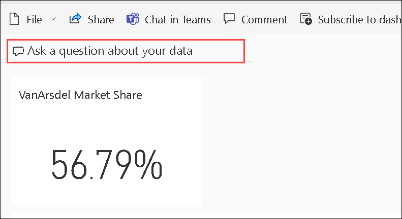

1. In the text box, start typing **VanArsdel market share (1)** then click arrow icon **-> (2)**. Notice that a card visual is created.

   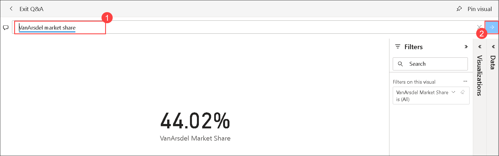

1. Continue typing **VanArsdel market share by country (1)** then click arrow icon **-> (2)**. Notice that a bar chart is created.

   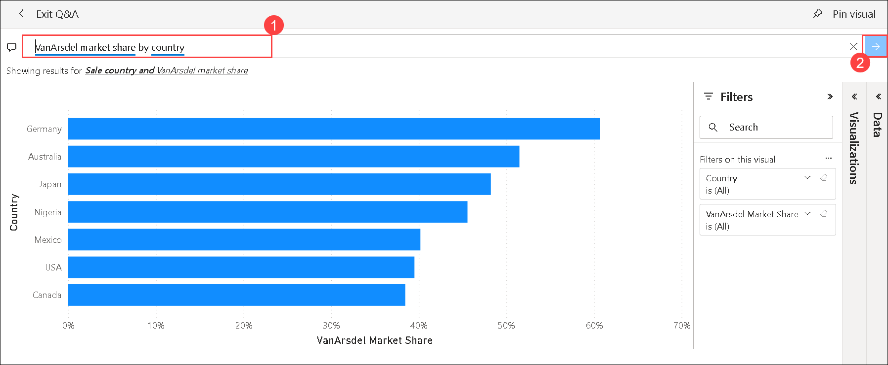

1. Continue typing **VanArsdel market share by country as treemap (1)** then click arrow icon **-> (2)**. Notice that a treemap visual is created.

    
  
    >**Note**: Remember that we renamed our tables. One of the reasons we did this was to make them user friendly for Q & A

1. In the top right of the screen, click **Pin Visual**.

    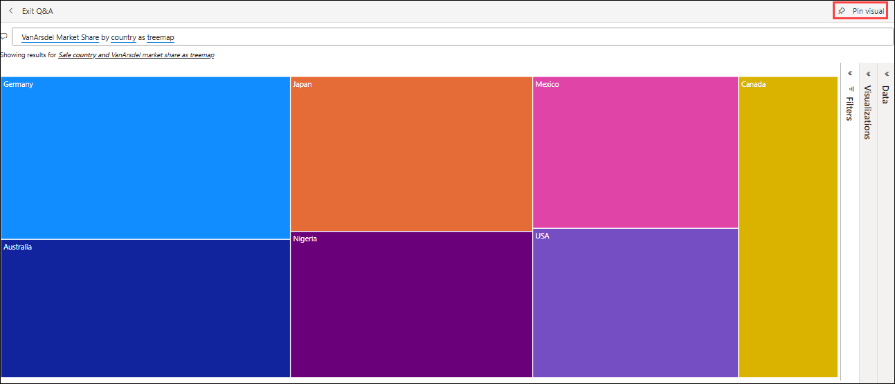

1. The **Pin to dashboard** dialog box opens. Make sure that **Existing dashboard (1)** then **VanArsdel (2)** is selected in the drop-down and then click **Pin (3)** to pin the visual to the **VanArsdel** dashboard.

    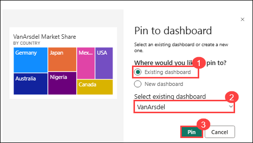
    
1. Close the alert dialog boxes.

1. Click **Exit Q&A** to navigate back to the dashboard.

1. Notice that the visual is added as tile to the dashboard. Clicking on the treemap visual will navigate you back to the Q & A section.

    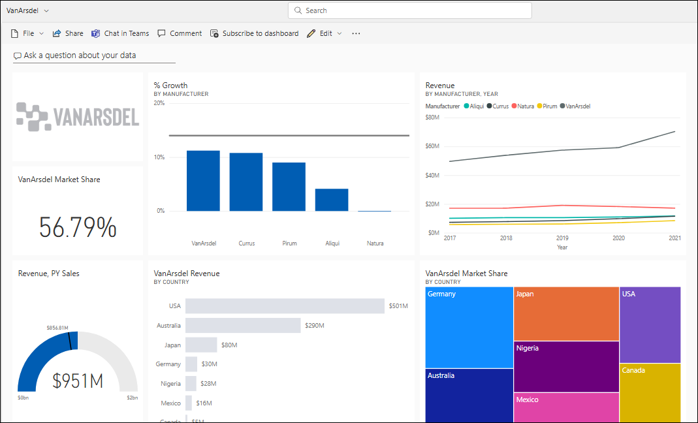

    >**Note**: Power BI quickly searches different subsets of your dataset while applying a set of sophisticated algorithms to discover potentially interesting insights. You can run insights against a dataset or a dashboard tile.

1. Let’s generate insights on a dashboard tile. When we run insights on a dashboard tile, instead of searching for insights against an entire dataset, the search is narrowed to the data used to create a single dashboard tile. This is often referred to as scoped insights.

1. Hover over the **line chart** on the dashboard.

1. Click the **ellipse (...) (1)** on the top right corner and then click **View Insights (2)**.

    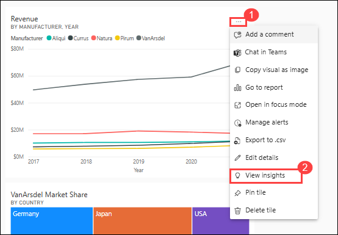
  
    You will be navigated to **Focus mode** for the line chart.

1. Scroll on the Insights panel to review the various insights Power BI can generate. Notice that there is an option to pin insight visuals to the dashboard.

    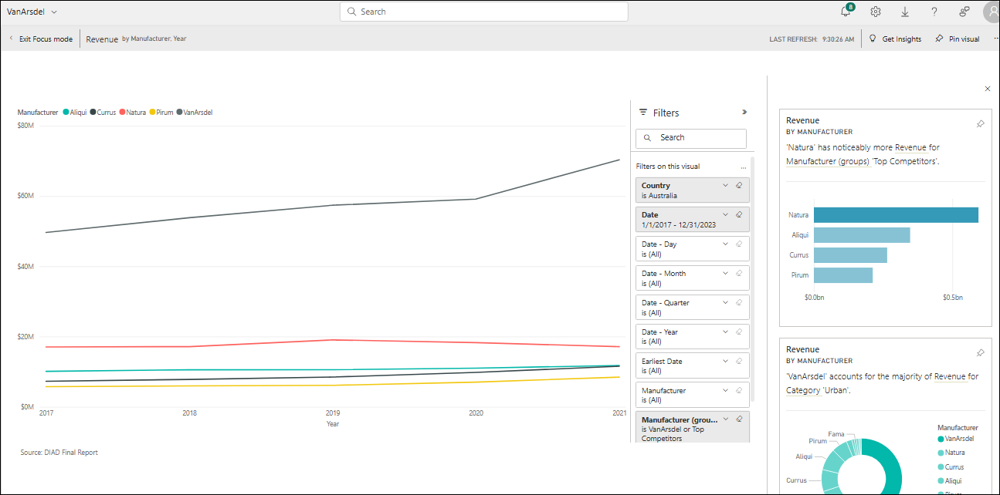

1. Click **Exit Focus mode** in the top left to navigate back to the dashboard.

    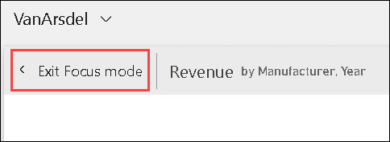

1. We want to be notified when VanArsdel’s Market Share goes above or below a threshold. We can set up alerts to achieve this.

1. Hover over **VanArsdel Market Share** tile.

1. Click on the **ellipse (...) (1)** in the top right corner of the tile the click **Manage alerts (2)**. The **Manage alerts** dialog box opens.

    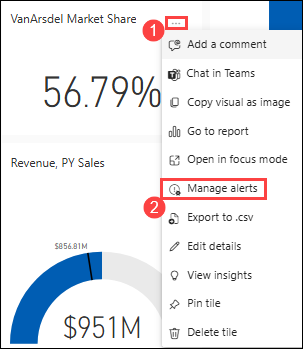

1. On the ***Manage alerts** page, click **+Add alert rule (1)** dialog and the click **Cancel (2)**

    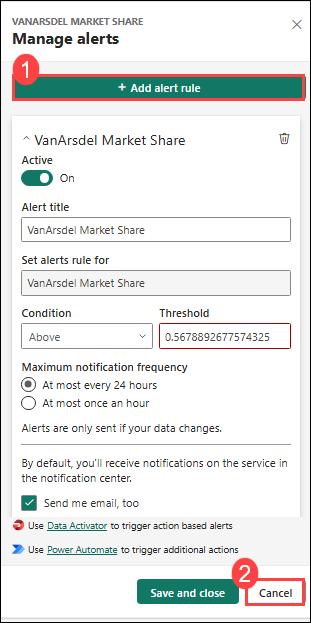
  
    >**Note**: Notice that you can add **Above** or **Below threshold**. You can also set the notification frequency. This is just an introduction to managing alerts. Complete functionality is not covered in this lab.

1. Click **Cancel** to close the dialog box.

1. Click **Don’t Save**.

1. Click on the **VanArsdel Market Share** tile to navigate to the report.

1. In the map visual, ensure it is at the **Country (1)** level, right-click the **Australia (2)** bubble, click **Drill through (3)** and click then **By Manufacturer (4)**. 
  
    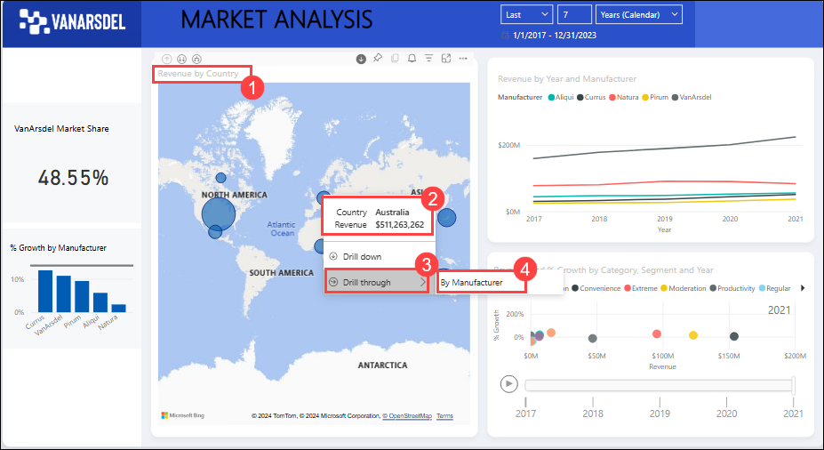

    >**Note:** If the map visual is not set to **Country** level, use the drill up arrow to set up.

    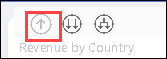

    You will be navigated to the **By Manufacturer** page of the report with the **Australia** filter applied to the report page.

1. Hover over the **matrix** visual.

1. Click the **focus mode** icon on the top right corner of the visual.

    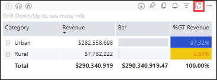

1. Click the **+** icon to expand.

    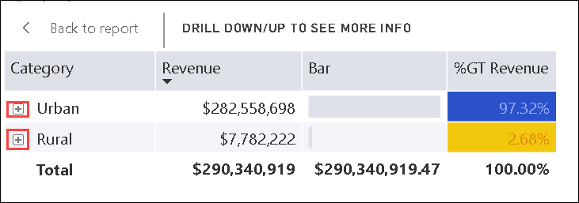

1. Click **Back to report.**

    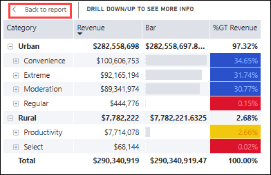
  
1. From the top right menu, click **Bookmarks (1)** and then click **Show more bookmarks (2)**. The **Bookmark** pane opens on the right. There are two options: **Personal** bookmarks and **Report** bookmarks.

   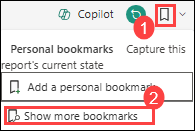
  
    - Report bookmarks are the bookmarks the report author created (we did this in Power BI Desktop).

    - Personal bookmarks on the report are ones which the consumer can create on their own.

1. Click **View (2)** in the **Report bookmarks (1)** pane.

    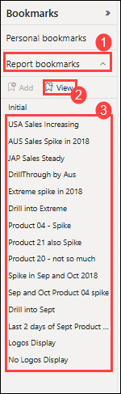  

    >**Note**: Notice that you can view and navigate through the bookmarks using the arrow at the bottom of the screen. This behavior is like in Power BI Desktop.

              
  
1. Click **Exit** in the **Bookmark** pane to close it.

    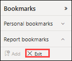 

1. Power BI provides an option to get quick insights into the complete dataset.

1. In the left panel, click on **DIAD_<inject key="DeploymentID" enableCopy="false"/>** and then click **DIAD Final Report**.

1. Click the **ellipse (...) (1)** then click on **Quick Insights (2)**.

   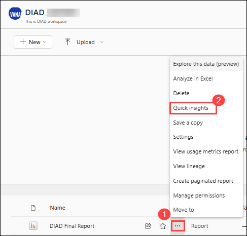
  
    >**Note**: It might take a few minutes for the insights to be created. Once insights are ready, a message appears in the top right corner.

1. Click **View insights.**

    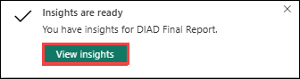
  
    >**Note**: A quick insights report is displayed based on the dataset. This provides insights into data you may have missed and helps to get a quick start on creating dashboards. Hovering over each report provides an option to **Pin it** to a dashboard.

    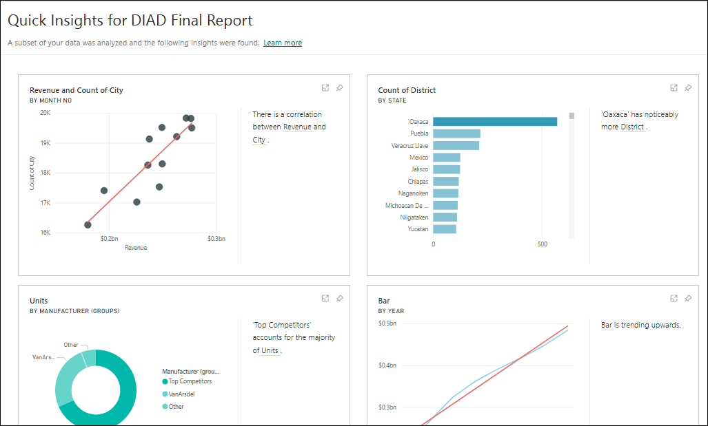  

You’ve now successfully completed Lab! Throughout this lab, you have learned how to apply conditional formatting, add a logo to the manufacturer filter, import a custom visual, and apply a custom theme to the report. You also learned how to add bookmarks to tell a story about the report.

## References

In the ribbon of the Power BI Desktop, the Help section has links to some great resources.

   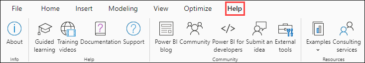

Here are a few more resources that will help you with your next steps with Power BI.

  - Getting started: https://app.powerbi.com/
  - Power BI Desktop: https://powerbi.microsoft.com/desktop
  - Power BI Mobile: https://powerbi.microsoft.com/mobile
  - Community site https://community.powerbi.com/
  - Power BI Getting started support page: https://support.powerbi.com/knowledgebase/articles/430814-get-started-with-power-bi
  - Support site https://support.powerbi.com/
  - Feature requests https://ideas.powerbi.com/forums/265200-power-bi-ideas
  - New ideas for using Power BI https://aka.ms/PBI_Comm_Ideas
  - Power BI Courses http://aka.ms/pbi-create-reports
  - Power Platform https://powerplatform.microsoft.com/en-us/instructor-led-training/
  - Power Apps [Business Apps | Microsoft Power Apps](https://powerapps.microsoft.com/en-us/)
  - Power Automate [Power Automate | Microsoft Power Platform](https://powerapps.microsoft.com/en-us/)
  - Dataverse [What is Microsoft Dataverse? - Power Apps | Microsoft Docs](https://docs.microsoft.com/en-us/powerapps/maker/data-platform/data-platform-intro)
## Summary
In this exercise, you started with a pre-created Power BI report and enhanced it by applying conditional formatting, adding logos, importing custom visuals, and applying custom themes. You then used bookmarks to improve storytelling and published the final report to the Power BI Service for sharing and collaboration.

## You have successfully completed this Lab!

